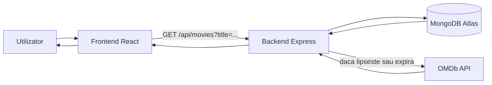
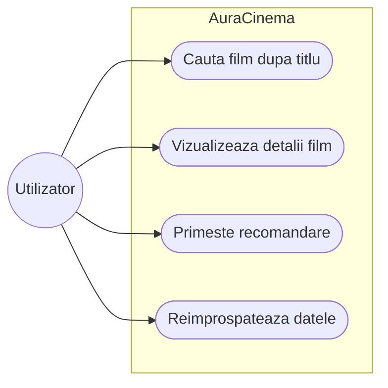
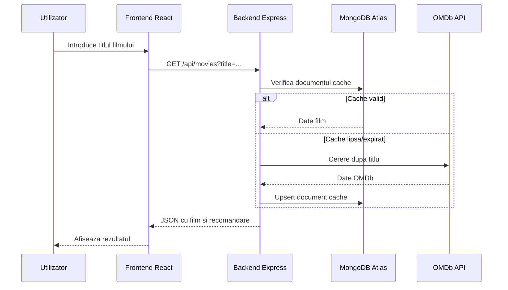

# AuraCinema - Documentatie proiect

## 1. Scopul aplicatiei

AuraCinema este o aplicatie web full-stack care permite cautarea unui film dupa titlu, afiseaza informatii preluate din OMDb si propune o recomandare bazata pe scorul publicului. Aplicatia afiseaza titlul, anul, ratingul de varsta, durata, sinopsisul, posterul si sursa scorului.

Regulile de recomandare sunt:

- daca scorul publicului este peste 80%, utilizatorul primeste recomandarea de a viziona filmul imediat;
- daca scorul este sub 50%, utilizatorul primeste recomandarea de a evita filmul;
- intre 50% si 80%, aplicatia ofera o recomandare neutra;
- daca nu exista scor disponibil, aplicatia afiseaza datele filmului fara o recomandare ferma.

## 2. Tehnologii utilizate

- Frontend: React, JavaScript, Vite, CSS standard.
- Backend: Node.js, Express, CORS, dotenv.
- Stocare: MongoDB Atlas prin MongoDB Node.js Driver.
- API extern: OMDb API.
- Documentatie: Markdown, Mermaid si PDF generat local.

## 3. Arhitectura de ansamblu

Frontend-ul trimite o cerere catre backend pentru titlul cautat. Backend-ul verifica intai cache-ul din MongoDB Atlas. Daca intrarea exista si nu a expirat, raspunsul este intors direct. Daca intrarea lipseste, este expirata sau utilizatorul cere refresh, backend-ul interogheaza OMDb, normalizeaza raspunsul, salveaza intrarea in MongoDB si intoarce datele catre frontend.



## 4. Use Case

Actorul principal este utilizatorul aplicatiei. Sistemul este AuraCinema.



## 5. Diagrama de activitate


## 6. Diagrama de interactiune



## 7. API si flux de date

Endpoint-uri:

- `GET /api/health` - verifica daca serverul ruleaza.
- `GET /api/movies?title=Movie+Name` - cauta filmul, folosind cache-ul daca este valid.
- `GET /api/movies?title=Movie+Name&refresh=true` - ignora cache-ul si cere date noi din OMDb.

Raspunsul principal contine:

```json
{
  "title": "Guardians of the Galaxy",
  "year": "2014",
  "rated": "PG-13",
  "runtime": "121 min",
  "plot": "A group of intergalactic criminals...",
  "poster": "https://...",
  "scorePercent": 92,
  "scoreSource": "Rotten Tomatoes",
  "recommendation": "Ar trebui sa vizionati acest film chiar acum!",
  "cached": true,
  "cacheExpiresAt": "2026-05-06T12:00:00.000Z"
}
```

## 8. Cache si expirare

Cache-ul este salvat in MongoDB Atlas, in baza de date `auracinema` si colectia `movieCache`. Cheia documentului este titlul normalizat al filmului: fara spatii inutile si cu litere mici. Durata implicita a cache-ului este de 24 de ore si poate fi schimbata prin `CACHE_TTL_HOURS`.

Backend-ul creeaza un index TTL pe campul `expiresAt`, astfel incat MongoDB poate sterge automat documentele expirate. Daca utilizatorul apasa reimprospatare, frontend-ul trimite `refresh=true`, iar backend-ul ocoleste cache-ul pentru cautarea respectiva.

## 9. Rulare locala

```bash
npm install
```

Terminal 1:

```bash
cd backend
npm run dev
```

Terminal 2:

```bash
cd frontend
npm run dev
```

In `backend/.env` trebuie completate variabilele `PORT`, `CORS_ORIGIN`, `CACHE_TTL_HOURS`, `MONGODB_URI`, `MONGODB_DB_NAME`, `MONGODB_CACHE_COLLECTION` si `OMDB_API_KEY`. In `frontend/.env` se pastreaza doar `VITE_API_BASE_URL=http://localhost:4000`. Backend-ul ruleaza pe `http://localhost:4000`, iar frontend-ul pe `http://localhost:5173`.

## 10. Deployment

Backend-ul se publica pe Render ca Web Service cu root directory `backend`, build command `npm install`, start command `npm start` si health check path `/api/health`. Variabilele necesare sunt `MONGODB_URI`, `MONGODB_DB_NAME`, `MONGODB_CACHE_COLLECTION`, `CACHE_TTL_HOURS`, `OMDB_API_KEY` si `CORS_ORIGIN`.

Frontend-ul se publica pe Vercel ca proiect separat din acelasi repository, cu root directory `frontend`, framework `Vite`, build command `npm run build` si output directory `dist`. Variabila `VITE_API_BASE_URL` trebuie sa pointeze spre URL-ul backend-ului de pe Render.

In varianta finala, backend-ul a fost deployat pe Render la `https://auracinema-be.onrender.com`, iar frontend-ul a fost deployat pe Vercel. Dupa obtinerea URL-ului de Vercel, variabila `CORS_ORIGIN` din Render trebuie setata catre acel URL.

Pentru conectarea la MongoDB Atlas, in Network Access trebuie permise IP-urile de iesire ale serviciului Render. In timpul testarii se poate folosi `0.0.0.0/0`, dar nu este varianta recomandata pe termen lung.

## 11. Verificari

Au fost rulate testele backend cu `npm test`, build-ul frontend cu `npm run build` si generarea PDF-ului cu `npm run docs:pdf`. Pentru deploy se verifica endpoint-ul `/api/health`, apoi o cautare reala, de exemplu `/api/movies?title=Dune`.
