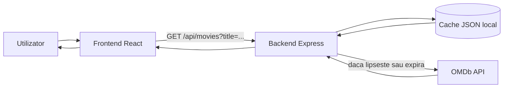
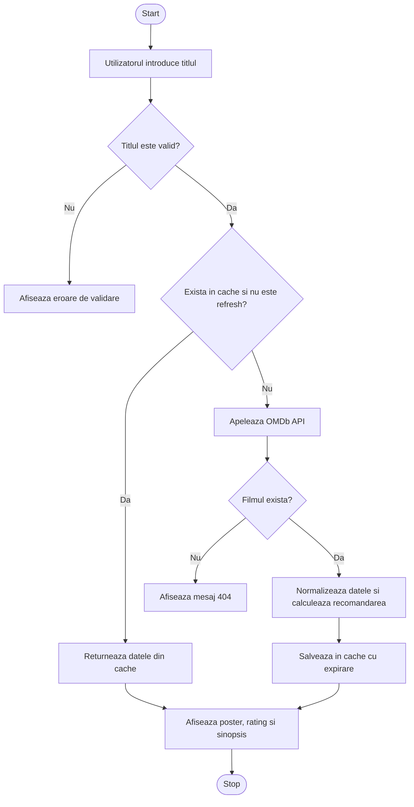
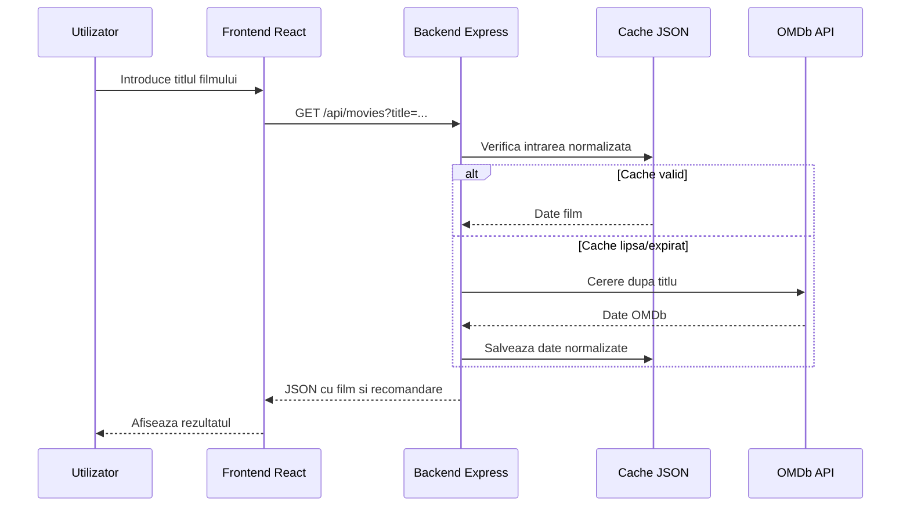

# AuraCinema - Documentatie proiect

## 1. Scopul aplicatiei

AuraCinema este o aplicatie web full-stack care permite cautarea unui film dupa titlu, afiseaza informatii preluate din OMDb si propune o recomandare bazata pe scorul publicului. Aplicatia afiseaza titlul, anul, ratingul de varsta, durata, sinopsisul, posterul si sursa scorului.

Regulile de recomandare sunt:

- daca scorul publicului este peste 80%, utilizatorul primeste recomandarea de a viziona filmul imediat;
- daca scorul este sub 50%, utilizatorul primeste recomandarea de a evita filmul;
- intre 50% si 80%, aplicatia ofera o recomandare neutra;
- daca nu exista scor disponibil, aplicatia afiseaza datele filmului fara o recomandare ferma.

## 2. Tehnologii utilizate

- Frontend: React, JavaScript, Vite, CSS standard.
- Backend: Node.js, Express, CORS, dotenv.
- Stocare: fisier JSON local pentru cache (`backend/data/movies-cache.json`).
- API extern: OMDb API.
- Documentatie: Markdown, Mermaid si PDF generat local.

## 3. Arhitectura de ansamblu

Frontend-ul trimite o cerere catre backend pentru titlul cautat. Backend-ul verifica intai cache-ul JSON. Daca intrarea exista si nu a expirat, raspunsul este intors direct. Daca intrarea lipseste, este expirata sau utilizatorul cere refresh, backend-ul interogheaza OMDb, normalizeaza raspunsul, salveaza intrarea in cache si intoarce datele catre frontend.



## 4. Use Case

Actorul principal este utilizatorul aplicatiei. Sistemul este AuraCinema.


## 5. Diagrama de activitate



## 6. Diagrama de interactiune



## 7. API si flux de date

Endpoint-uri:

- `GET /api/health` - verifica daca serverul ruleaza.
- `GET /api/movies?title=Movie+Name` - cauta filmul, folosind cache-ul daca este valid.
- `GET /api/movies?title=Movie+Name&refresh=true` - ignora cache-ul si cere date noi din OMDb.

Raspunsul principal contine:

```json
{
  "title": "Guardians of the Galaxy",
  "year": "2014",
  "rated": "PG-13",
  "runtime": "121 min",
  "plot": "A group of intergalactic criminals...",
  "poster": "https://...",
  "scorePercent": 92,
  "scoreSource": "Rotten Tomatoes",
  "recommendation": "Ar trebui sa vizionati acest film chiar acum!",
  "cached": true,
  "cacheExpiresAt": "2026-05-06T12:00:00.000Z"
}
```

## 8. Cache si expirare

Cache-ul este salvat in `backend/data/movies-cache.json`. Cheia este titlul normalizat al filmului: fara spatii inutile si cu litere mici. Durata implicita a cache-ului este de 24 de ore si poate fi schimbata prin `CACHE_TTL_HOURS`.

Daca utilizatorul apasa reimprospatare, frontend-ul trimite `refresh=true`, iar backend-ul ocoleste cache-ul pentru cautarea respectiva.

## 9. Rulare locala

```bash
npm install
cp .env.example .env
npm run dev
```

In `.env` trebuie completata variabila `OMDB_API_KEY`. Frontend-ul ruleaza pe `http://localhost:5173`, iar backend-ul pe `http://localhost:4000`.
